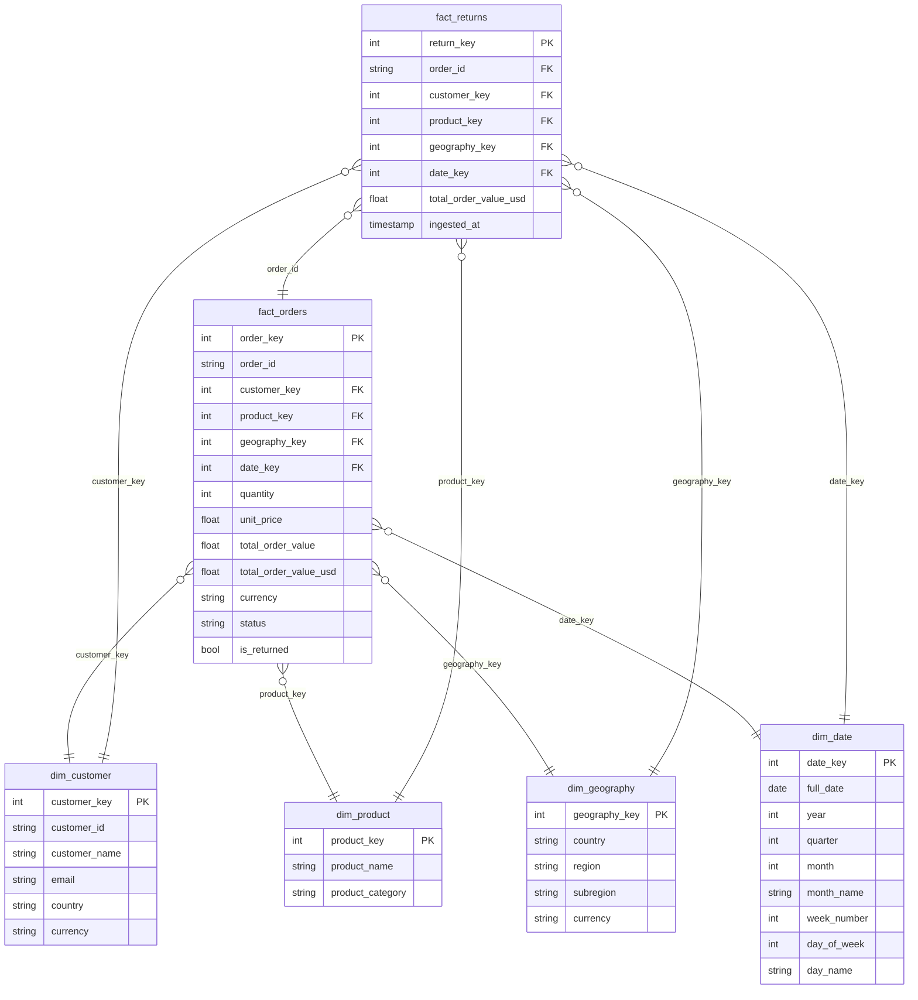

# E-Commerce Sales Data Pipeline

An automated, end-to-end data pipeline that ingests daily e-commerce orders, transforms and validates them, loads them into a SQL Server data warehouse, and serves a live Power BI dashboard — all orchestrated by Apache Airflow.

> **Runs every night at midnight. Zero manual effort after setup.**

---

## Architecture

```
Faker + APIs  ──►  Python (Pandas)  ──►  Apache Airflow  ──►  SQL Server  ──►  Power BI
  [Ingest]          [Transform]          [Orchestrate]        [Warehouse]      [Report]
```

### Pipeline DAG (4 tasks)

```
ingest  ──►  transform  ──►  quality_check  ──►  load
```

Each task must succeed before the next one starts. If `quality_check` fails, the load is aborted — bad data never reaches the warehouse.

---

## Project Structure

```
ecommerce_pipeline/
├── data/
│   ├── landing/          # Raw JSON files (orders, FX rates, countries)
│   └── staging/          # Cleaned Parquet files ready for loading
├── scripts/
│   ├── generate_orders.py      # Faker-based order generator
│   ├── fetch_reference_data.py # FX rates + country reference data
│   ├── transform.py            # Cleaning, enrichment, feature engineering
│   ├── load.py                 # Upserts into SQL Server star schema
│   ├── db_connection.py        # SQLAlchemy engine setup
│   └── create_tables.sql       # DDL for all tables + summary view
├── dags/
│   └── ecommerce_dag.py        # Airflow DAG definition
├── .env                        # API keys (not committed)
├── .gitignore
├── requirements.txt
└── README.md
```

---

## Data Warehouse — Star Schema



| Table | Rows (per day) | Description |
|---|---|---|
| `dim_customer` | ~950 | Unique customers from daily orders |
| `dim_product` | 25 | 5 categories × 5 products (static) |
| `dim_geography` | 20 | Country, region, subregion, currency |
| `dim_date` | 1/day | Date attributes for each pipeline run |
| `fact_orders` | 1,000 | Daily order records with USD revenue |
| `fact_returns` | ~150 | Subset of returned orders |

Power BI connects to `vw_sales_summary` — a flat view joining all tables.

---

## Tech Stack

| Layer | Tool |
|---|---|
| Data generation | Python · Faker · Open Exchange Rates API |
| Transformation | Python · Pandas · Parquet |
| Orchestration | Apache Airflow 2.9 |
| Database | SQL Server (SSMS) · SQLAlchemy · pyodbc |
| Reporting | Power BI Desktop · DAX · DirectQuery |
| Environment | WSL2 (Ubuntu) · VS Code |


## DAX Measures

```dax
Total Revenue =
    SUM(vw_sales_summary[total_order_value_usd])

Total Orders =
    COUNTROWS(vw_sales_summary)

Avg Order Value =
    DIVIDE([Total Revenue], [Total Orders], 0)

Return Rate % =
    VAR returned = CALCULATE(COUNTROWS(vw_sales_summary),
                             vw_sales_summary[is_returned] = TRUE())
    RETURN DIVIDE(returned, [Total Orders], 0)

Revenue Lost =
    CALCULATE(SUM(vw_sales_summary[total_order_value_usd]),
              vw_sales_summary[is_returned] = TRUE())
```

---

## Dashboard Pages

| Page | Key Visuals |
|---|---|
| Sales Overview | Revenue KPIs, daily trend line, revenue by category bar chart, order status breakdown |
| Geography | Revenue map by country, top 10 countries bar, region donut chart |
| Returns Analysis | Return rate KPI, returns by category, trend over time, drill-through from Page 1 |

---

## Key Design Decisions

**Why Faker instead of a real e-commerce API?**
Real APIs (Shopify, WooCommerce) require store access. Faker produces realistic, controllable data at any volume — this is standard practice for pipeline portfolio projects.

**Why a star schema instead of one flat table?**
Dimension tables store reference data once. Fact tables store events. Querying 1,000 fact rows joined to 25 product rows is far faster than scanning 1,000 rows with repeated product names embedded in each row.

**Why a quality_check task before loading?**
If the ingest or transform step produces empty or invalid data, the quality check stops the pipeline before any bad data reaches SQL Server. This is what makes a pipeline production-grade rather than just a scheduled script.

**Why DirectQuery in Power BI?**
Import mode caches data and goes stale. DirectQuery queries SQL Server live on every interaction — so the dashboard always reflects last night's pipeline run without any manual refresh.

---

## Requirements

```
faker
pandas
requests
sqlalchemy
pyodbc
python-dotenv
pyarrow
apache-airflow==2.9.0
```


https://github.com/user-attachments/assets/1abe6057-294a-46f9-adb5-5d533adb24df


